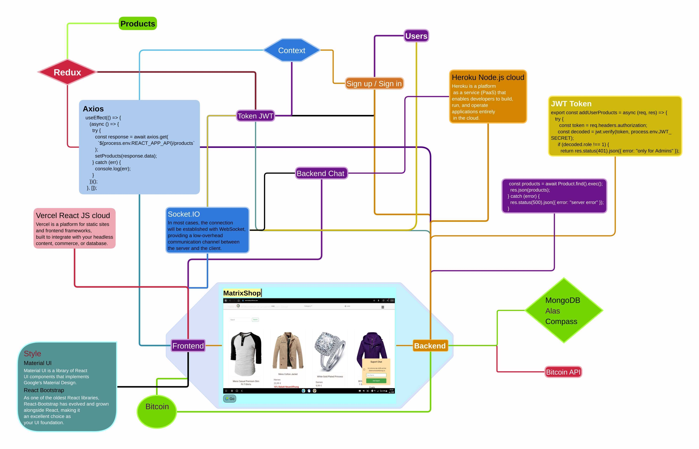

Final Project -- Ecommerce website with the MERN stack with React Context API
===
Full Stack Developer
## DCI 
- Sham Alhakim
- Enza
- Orhan Kadirov
- Ventsislav Kolev


## Install & Dependence
- React JS - Frontend
- Express - Backend
- MongoDB - Databank

##Intitial release
- [GitHub Frontend](https://github.com/venskolev/matrixshop-frontend)
- [GitHub Backend](https://github.com/OrhanKadirov/matrixshop-backend)


## Use
- for React JS
  ```
  npm install
  ```
  ```
  npm i react-dom
  ```
- for Express
  ```
  npm install
  ```
  npm i nodemon
  ```


